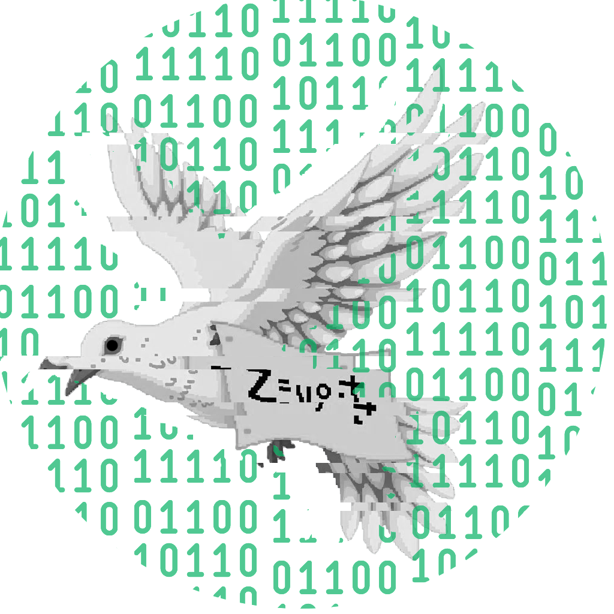

    </img>

    <h1> [Cipher Dove] </h1>
    
An open-source, offline, ad-free, basic encryption and decryption tool. 

    
    
    

## Quick Start
Currently, this app only supports for Android. I am unable to test the app for iOS platform, since I don't have any apple device.

[Download latest version here.](https://github.com/Daniel-C-J/cipher_dove/releases)

## About Cipher 
This project, **Cipher Dove**, is an application intended for the purpose of showcasing my flutter skills... and also for fun.

1) This app is just your another simple basic encryption-decryption application with known and common algorithms, but optimized with certain packages that is fast, and have low memory consumptions. 
2) This app is quite small, around 30MB.
3) This app android `min-sdk` is 21. 
4) This app sole network request is only to this github page to check the version. (So no data of your phone sent)

 

Currently this app supports:
- Aes Encryption/Decryption
- Chacha20 Encryption/Decryption
- Md5 Hash
- Sha-1 Hash
- Sha-2 Hash
- Sha-3 Hash
- Blake2 Hash

</img>
</img>
</img>
</img>
  
Upcoming cipher algorithms:
- RSA
- DSA
- ECC
- Argon2
- etc...

 

Overview of this project dependencies:
- Riverpod (State Management & Dependency Injection)
- Dio (Network requests)
- Logger (Logging)
- Localizations
- And many more...!

[See Changelog](./CHANGELOG.md)

## Community and support
No, currently I'm not accepting new features, but you can still submit a bug report.

Yes, coffee is okay for me.

## Install
Please head to the [release](https://github.com/Daniel-C-J/cipher_dove/releases) section to find the latest version of the app.

## Build
Make sure you have Flutter framework v3.27.4+ installed.

1. Clone this repository `git clone https://github.com/Daniel-C-J/cipher_dove.git`
2. Open your terminal and `cd` to the root path of the repository
3. Type `flutter build --help` then head down to the `Available subcommands:` section, you'll be able to found the platform specific options to build the app. If you want to just build for android then simply type `flutter build apk`.
4. The output path is usually in `./build`, for android specifically it is in `./build/app/outputs/flutter-apk/` alongside with the sha-1 hash.
5. And you're done! Congrats 🎉!
   

## License
[MIT](./LICENSE)
